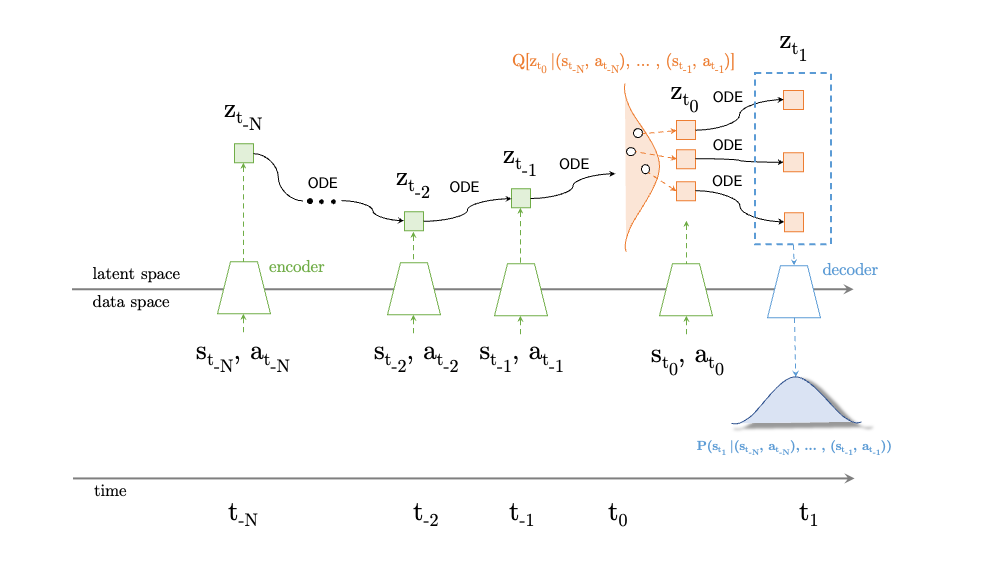

# ERODE: Emission-Reducing Ordinary Differential Equations

  

ERODE combines continuous depth neural networks ([Latent ODEs](https://papers.nips.cc/paper/2019/hash/42a6845a557bef704ad8ac9cb4461d43-Abstract.html) (Rubanova, 2019)) with ideas from model-based and model-free Reinforcement Learning for control of energy systems. It is hypothesised that the inductive biases enforced by the ODE solver may improve the predictive accuracy of our energy system world model, as compared with other techniques like [(Jeen, 2022)](https://arxiv.org/abs/2206.14191). This repo was set up to test ideas, and therefore represents the textbook shortcomings one would expect of research code. I apologise for any pain this may cause you.  
